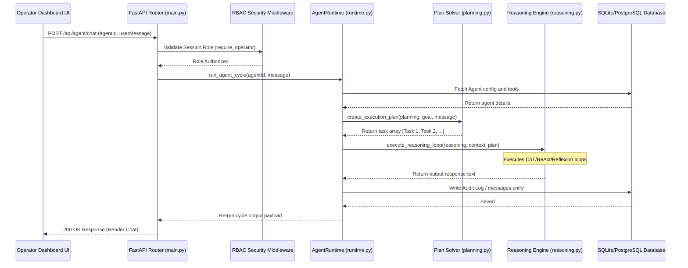

# AIOS Enterprise Clean Architecture & DDD Specifications

This document outlines the software engineering principles, folder structure guidelines, and operational patterns implemented inside the Autonomous Intelligence Operating System (AIOS) core platform.

## 1. Architectural Layers Overview

AIOS utilizes **Enterprise Clean Architecture** to isolate business capabilities from delivery interfaces. The module flow moves inward:

```
[Client SPA UI] ──(HTTP/WS)──> [API Gateway (Nginx)]
                                      │
                                      ▼
                            [FastAPI Controllers] (Routing, Swagger, Schemas)
                                      │
                                      ▼
                            [Business Service Layer] (Security, RBAC, Encryption)
                                      │
                                      ▼
                            [AI Agent Cognitive Runtime] (Reasoning, Planning)
                                      │
                                      ▼
                            [Repository Layer] (PostgreSQL, Redis, Qdrant, Neo4j)
```

### Data Isolation
- **Domain Entities**: Encapsulates data formats (e.g. `AgentModel` in `backend/domain/models.py`) free from routing code.
- **Pydantic Validation**: Controls entry contracts via schema definitions in `backend/domain/schemas.py`.

---

## 2. SOLID Design Principles Adherence

- **Single Responsibility Principle (SRP)**: Each repository holds queries for exactly one model database tables. Planners and reasoning loops reside in separate, focused modules.
- **Open/Closed Principle (OCP)**: Futuristic features (Quantum, Digital Twins) extend capability pipelines via plug-and-play Abstract Base Class interfaces (`backend/plugins/base.py`) without modifying execution controllers.
- **Liskov Substitution Principle (LSP)**: All plugins inherit from `BasePlugin` and are fully interchangeable inside the `PluginRegistry` container.
- **Interface Segregation Principle (ISP)**: Telemetry streams are separated between REST endpoints, MQTT clients, and gRPC channels based on transport performance demands.
- **Dependency Inversion Principle (DIP)**: Controllers interact with abstract repositories instead of raw SQL queries, decoupling state drivers.

---

## 3. Operations Sequence Flow

The diagram below details the execution lifecycle when an operator triggers a task query on an active Agent node:


